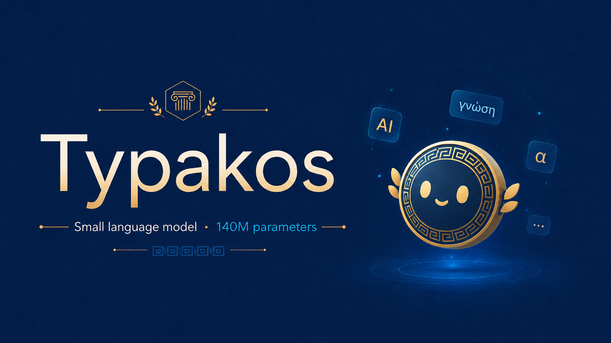

---
language:
- en
- el
license: mit
library_name: transformers
base_model: alexliap/typakos-140m-base
pipeline_tag: text-generation
tags:
- llama
- bilingual
- greek
- instruction-tuned
- sft
- dpo
- conversational
datasets:
- openeurollm/Dolci-Instruct-SFT-translated
- openeurollm/EU-Instruct-Synthetic
- CohereLabs/aya_dataset
- HuggingFaceTB/smoltalk
- openeurollm/Dolci-Instruct-DPO-translated
---

# Typakos-140M-it



The name "Typakos" comes from the Greek "Τυπάκος," meaning "small dude," a nod to the model's small (140M) parameter count.

Typakos-140M-it is the instruction-tuned, preference-aligned chat model built on top of
[`alexliap/typakos-140m-base`](https://huggingface.co/alexliap/typakos-140m-base), a 140M-parameter
bilingual (Greek/English) base language model. It's produced by a two-stage post-training pipeline
on the base checkpoint: supervised fine-tuning (SFT) for instruction-following and chat formatting,
followed by Direct Preference Optimization (DPO) for preference alignment. Both stages are
full-parameter (no LoRA): 140M params is small enough not to need it.

The full training pipeline, code, and configs live in
[`scripts/typakos_140m/`](https://github.com/alexliap/pretrain/tree/llama120_gr/scripts/typakos_140m)
on GitHub.

## Model Details

Same architecture as the base model, with the vocabulary grown by 3 chat-template special tokens
(added in the SFT stage, see below).

| Model Configuration | Value |
|---|---|
| Layers | 18 |
| Hidden size | 768 |
| Intermediate size | 1792 |
| Attention heads | 12 (query) / 6 (KV, grouped-query attention) |
| Head dim | 64 |
| Context length | 2048 |
| Vocab size | 50,261 (base 50,258 + 3 chat-template special tokens) |
| Tied embeddings | yes |
| Precision | bf16 |
| Parameters | ~145M total, ~106M non-embedding |

## Tokenizer & Chat Template

Starts from the base model's byte-level BPE tokenizer (50,000 merges + 256 byte tokens +
`<|begin_of_text|>`/`<|end_of_text|>`). The SFT stage adds three Llama-3-style special tokens
(`<|start_header_id|>`, `<|end_header_id|>`, `<|eot_id|>`) and resizes the (tied) embedding matrix
to match, with the new rows mean/covariance-initialized rather than random.

The chat template (adapted from TRL's `llama3_training.jinja`) renders each turn as:

```
<|start_header_id|>ROLE<|end_header_id|>

CONTENT<|eot_id|>
```

and wraps assistant turns in `` / `` markers, which the SFT
stage uses to mask the training loss to assistant tokens only (`assistant_only_loss=True`).

## Training Pipeline

### Stage 0: Pretraining (recap)

Trained from scratch, full-parameter, on ~9.33B tokens split roughly 50/50 English/Greek. See
[`alexliap/typakos-140m-base`](https://huggingface.co/alexliap/typakos-140m-base) for the full
pretraining data mix and procedure.

### Stage 1: Supervised Fine-Tuning (SFT)

Teaches the base checkpoint the chat format and instruction-following, via `trl.SFTTrainer`.

**Data:** [`alexliap/typakos_sft_dataset`](https://huggingface.co/datasets/alexliap/typakos_sft_dataset),
built by [`prepare_sft_data.py`](prepare_sft_data.py) + [`concat_sft_data.py`](concat_sft_data.py):
7 filtered subsets from 4 upstream Hub sources, kept only if well-formed (an optional single
leading `system` turn, then alternating `user`/`assistant` turns ending on `assistant`) and
token-bounded to fit the 2048-token context, then shuffled and split 90/10 train/validation.

| source | upstream dataset | language | rows (final) |
|---|---|---|---:|
| dolci_el | openeurollm/Dolci-Instruct-SFT-translated | el | 448,718 |
| eu_instruct_el | openeurollm/EU-Instruct-Synthetic | el | 137,988 |
| aya_el | CohereLabs/aya_dataset (Greek subset) | el | 623 |
| aya_en | CohereLabs/aya_dataset (English subset) | en | 3,938 |
| smol_constraints | HuggingFaceTB/smoltalk (smol-constraints) | en | 34,423 |
| smol_magpie_ultra | HuggingFaceTB/smoltalk (smol-magpie-ultra) | en | 361,514 |
| smol_rewrite | HuggingFaceTB/smoltalk (smol-rewrite) | en | 53,342 |
| **TOTAL** | | | **1,040,546** |

~901M tokens total (~394M Greek, ~507M English), split into 936,491 train / 104,055 validation
conversations (shuffle seed 0, 10% held out).

| Training Configuration | Value |
|---|---|
| Trainer | `trl.SFTTrainer` |
| Batch size | 16/device |
| Gradient accumulation | 1 |
| Optimizer | AdamW, lr 2e-5, betas (0.9, 0.95), eps 1e-10, weight_decay 0.01 |
| LR schedule | Cosine, warmup 10% of steps |
| Epochs | 1.0 |
| Loss masking | Assistant turns only (`assistant_only_loss`) |
| Precision | bf16 |

### Stage 2: Direct Preference Optimization (DPO)

Aligns the SFT model to preference pairs via `trl.DPOTrainer`, starting from
Stage 1's last checkpoint.

**Data:** [`openeurollm/Dolci-Instruct-DPO-translated`](https://huggingface.co/datasets/openeurollm/Dolci-Instruct-DPO-translated)
(el + en configs), prepared by [`prepare_dpo_data.py`](prepare_dpo_data.py): concatenates both
language configs, shuffles (seed 0), and splits off 10% as validation. Rows are
`prompt`/`chosen`/`rejected` conversational triples.

| split | rows |
|---|---:|
| train | 423,954 |
| validation | 47,107 |

| Training Configuration | Value |
|---|---|
| Trainer | `trl.DPOTrainer` |
| Batch size | 8/device |
| Gradient accumulation | 1 |
| Optimizer | AdamW, lr 5e-6, betas (0.9, 0.95), eps 1e-10, weight_decay 0.01 |
| LR schedule | Constant with warmup, 500 warmup steps |
| Loss | sigmoid (standard DPO), beta 0.1 |
| Epochs | 1.0 |
| Precision | bf16 |

## How to Use

```python
from transformers import AutoModelForCausalLM, AutoTokenizer

model_id = "alexliap/typakos-140m-it"
tokenizer = AutoTokenizer.from_pretrained(model_id)
model = AutoModelForCausalLM.from_pretrained(model_id)

messages = [{"role": "user", "content": "Ποια είναι η πρωτεύουσα της Ελλάδας;"}]
input_ids = tokenizer.apply_chat_template(
    messages, add_generation_prompt=True, return_tensors="pt"
)

output = model.generate(input_ids, max_new_tokens=200, do_sample=True, temperature=0.7)
print(tokenizer.decode(output[0][input_ids.shape[-1] :], skip_special_tokens=True))
```

## Evaluation

_TBD: evaluation results pending._

## Limitations

- Small (140M parameter) model; expect base-rate reasoning/knowledge limitations consistent with
  its scale and ~9.33B-token pretraining budget (see the base model card's evaluation table).
- Preference data (`openeurollm/Dolci-Instruct-DPO-translated`) is translated rather than native
  Greek in the `el` split, which may carry translation artifacts into alignment behavior.

## License

MIT
